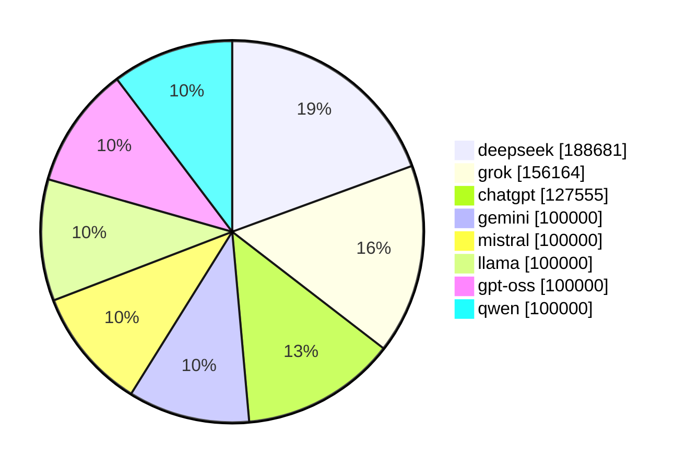

# LLM Investment Benchmark

A tool for benchmarking and tracking Large Language Model (LLM) investment decisions.

## Overview

This project provides a framework to create, manage, and track investment portfolios generated by LLM models. It allows you to:
- Create new portfolios
- List current holdings and recent context
- Update portfolios based on model decisions

The model executions and their current context can be seen [here](./orders).

## Automated Weekly Runs

The active model roster is configured in [models.json](./models.json). The weekly GitHub Actions workflow runs the benchmark every Monday, writes model orders under `orders/<model>/<date>.json`, stores the market snapshot in `prices/<date>.csv`, updates `llm100kbench.db`, and regenerates this README's current portfolio section.

The project is intentionally limited to free API tiers. Models that require paid metered API access or subscriptions are archived instead of being run automatically.

## Why?

To optimize their portfolio, the primary objective defined for the LLMs, it is imperative to evaluate the risk-reward ratio, formulate cogent assumptions about future market conditions, and leverage tools and their understanding of human psychology and financial market dynamics.

This benchmark may be a good proxy to measure how well LLMs are able to coordinate the aforementioned efforts.

## Notes

- `chatgpt`, `deepseek`, and `grok` are kept as continuing benchmark identities. Their exact backend model IDs are recorded in each new order's metadata.
- `perplexity` is archived for future runs because its API is paid and the free chat UI is not suitable for unattended automation.
- Claude and other paid-only APIs are not included while the project keeps the free-tier-only restriction.

## Project Structure

- `cmd`: Contains the main command implementations
  - `create`: Initialize new portfolios
  - `list`: Display current holdings and context
  - `update`: Process investment orders and update holdings
  - `stocks`: Fetch most recent stock prices

## Prompt

The most recent prompt with the clear guidelines can be see [here](./cmd/create/prompt.txt) and [here](./cmd/list/prompt.txt).

## Current Portfolio (2026-05-22)

### Portfolio Value by Model

| Model | Ticket | Sum | Quantity |
|-------|-------|-------|--------|
|`chatgpt`|`USD`|69|69|
|`chatgpt`|`AAPL`|127486|418|
|`deepseek`|`AMD`|1349|3|
|`deepseek`|`ASML`|159200|100|
|`deepseek`|`MSFT`|2934|7|
|`deepseek`|`SNPS`|25199|50|
|`grok`|`AAPL`|14640|48|
|`grok`|`AMZN`|21745|81|
|`grok`|`GOOGL`|24810|64|
|`grok`|`MSFT`|10896|26|
|`grok`|`NVDA`|84072|383|
|`gemini`|`USD`|100000|100000|
|`mistral`|`USD`|100000|100000|
|`llama`|`USD`|100000|100000|
|`gpt-oss`|`USD`|100000|100000|
|`qwen`|`USD`|100000|100000|

| Model | Total Sum | Change |
|-------|-----------|--------|
|`deepseek`|188681|—|
|`grok`|156164|—|
|`chatgpt`|127555|—|
|`gemini`|100000|—|
|`mistral`|100000|—|
|`llama`|100000|—|
|`gpt-oss`|100000|—|
|`qwen`|100000|—|
